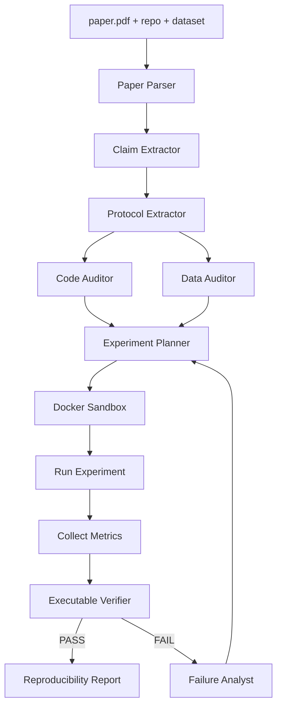
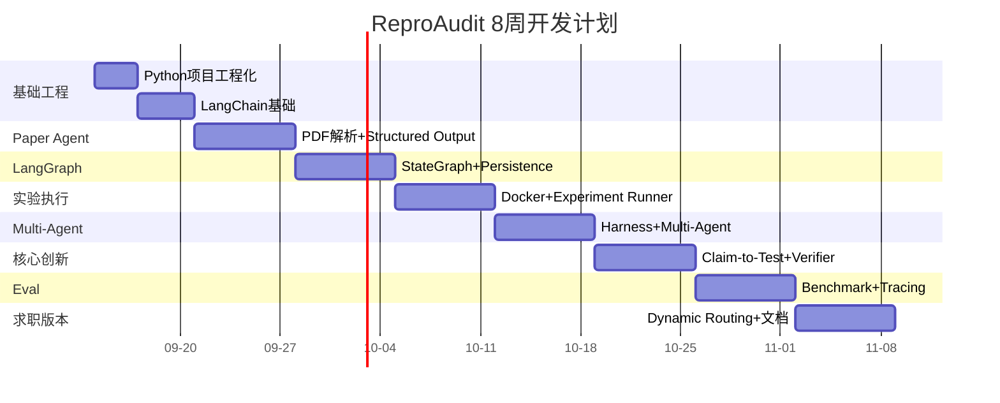
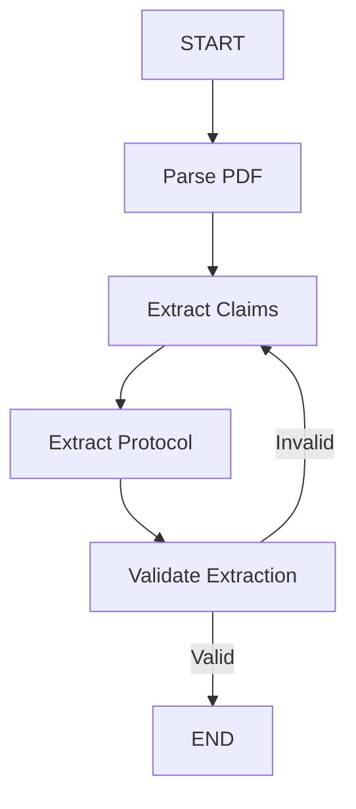
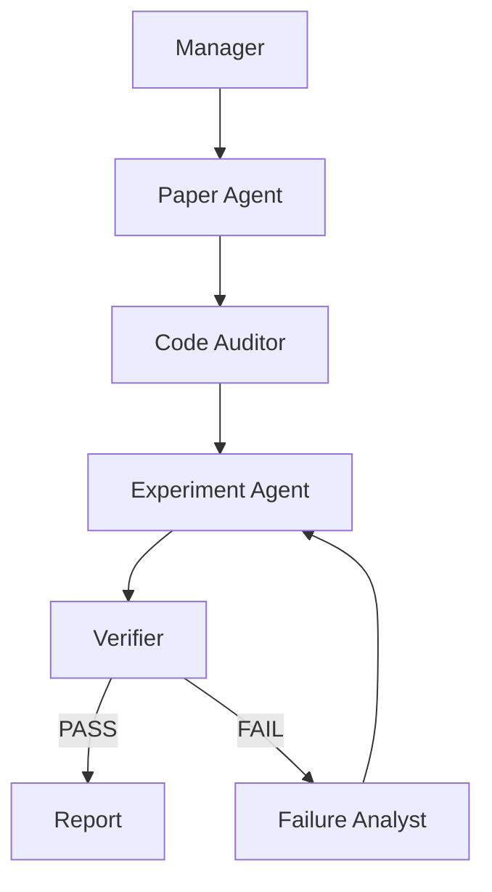

# ReproAudit 零基础逐步搭建手册
## 从 0 到完整科研可复现性审计 Agent

> 这不是“学习提纲”，而是一份施工手册。  
> 目标：你可以从一个空文件夹开始，一步一步把 ReproAudit 搭出来。  
> 默认环境：macOS + Python 3.13 + VS Code / Cursor / PyCharm 均可。  
> 主技术栈：Python + LangChain + LangGraph + FastAPI + Docker + MLflow + pytest。  
> 项目定位：科研可复现性审计 Agent，而不是普通论文问答 Agent。

---

# 0. 先明确：你最终到底要做什么

最终系统输入：

```text
paper.pdf
repo/
dataset/
需要验证的 scientific claim
```

最终系统要输出：

```text
1. 论文声明是什么
2. 论文实验协议是什么
3. 代码实现是否与论文一致
4. 数据协议是否与论文一致
5. 实验是否成功执行
6. 实际指标是多少
7. 是否在允许误差范围内复现
8. 如果没有复现，最可能原因是什么
9. 所有结论分别来自哪里
```

最终主流程：



---

# 1. 学习和开发总原则

整个项目只遵守 5 个原则：

1. 每学一个知识点，当天就放进项目。
2. 每天都必须有可运行结果。
3. 每周必须有一个里程碑版本。
4. 第一版不追求“功能多”，只追求“闭环跑通”。
5. 先做确定性能力，再做 Agentic 能力。

不要一开始就碰：

```text
Redis
Kafka
Kubernetes
完整 RAG
Vector DB
Agentic RL
SFT
复杂前端
TypeScript
Pi
```

---

# 2. 总体 8 周路线



---

# 3. Week 1：从空文件夹开始搭 Python 项目

## Day 1：创建项目骨架

### 目标

今天不做 Agent。

今天只做一件事：

> 建立一个正规的 Python 项目。

---

## Step 1：创建项目目录

终端执行：

```bash
mkdir -p ~/Documents/Agent/reproaudit
cd ~/Documents/Agent/reproaudit
```

确认：

```bash
pwd
```

预期看到：

```text
/Users/你的用户名/Documents/Agent/reproaudit
```

如果不是这个目录，不要继续。

---

## Step 2：创建虚拟环境

执行：

```bash
python3 -m venv .venv
```

激活：

```bash
source .venv/bin/activate
```

确认：

```bash
which python
python --version
```

预期：

```text
.../reproaudit/.venv/bin/python
Python 3.13.x
```

如果 `which python` 不是 `.venv/bin/python`，说明虚拟环境没有激活。

---

## Step 3：创建最小目录

执行：

```bash
mkdir -p src/reproaudit
mkdir -p tests

touch src/reproaudit/__init__.py
touch README.md
touch pyproject.toml
touch .gitignore
touch .env.example
```

查看：

```bash
find . -maxdepth 3 -type f
```

你应该看到：

```text
./src/reproaudit/__init__.py
./README.md
./pyproject.toml
./.gitignore
./.env.example
```

---

## Step 4：写 `.gitignore`

打开 `.gitignore`：

```gitignore
.venv/
.env
__pycache__/
.pytest_cache/
.ruff_cache/
*.pyc
.DS_Store

data/
artifacts/
mlruns/
```

为什么？

因为这些东西不应该提交 Git：

```text
虚拟环境
API Key
缓存
本地实验结果
```

---

## Step 5：写 `pyproject.toml`

第一版：

```toml
[project]
name = "reproaudit"
version = "0.1.0"
description = "Scientific reproducibility audit agent"
requires-python = ">=3.13"

[tool.pytest.ini_options]
pythonpath = ["src"]
testpaths = ["tests"]

[tool.ruff]
line-length = 100
```

你现在不用理解 TOML 所有语法。

先知道：

```text
[project]
= 项目基本信息

[tool.pytest.ini_options]
= pytest配置

[tool.ruff]
= Ruff配置
```

---

## Step 6：安装第一批依赖

执行：

```bash
pip install pytest ruff pydantic python-dotenv
```

确认：

```bash
pip list
```

你应该看到：

```text
pytest
ruff
pydantic
python-dotenv
```

---

## Step 7：创建第一个 Schema

创建：

```bash
touch src/reproaudit/schemas.py
```

写入：

```python
from pydantic import BaseModel


class ScientificClaim(BaseModel):
    text: str
    metric: str | None = None
    expected_value: float | None = None
```

你现在只需要理解：

```text
ScientificClaim
= 科研声明的数据结构
```

例如：

```text
Method X achieves 94.3% accuracy.
```

可以表示成：

```python
ScientificClaim(
    text="Method X achieves 94.3% accuracy.",
    metric="accuracy",
    expected_value=94.3,
)
```

---

## Step 8：写第一个测试

创建：

```bash
touch tests/test_schemas.py
```

写：

```python
from reproaudit.schemas import ScientificClaim


def test_scientific_claim():
    claim = ScientificClaim(
        text="Method X achieves 94.3% accuracy.",
        metric="accuracy",
        expected_value=94.3,
    )

    assert claim.metric == "accuracy"
    assert claim.expected_value == 94.3
```

运行：

```bash
python -m pytest
```

预期：

```text
1 passed
```

如果这里失败，不要继续。

---

## Step 9：运行 Ruff

执行：

```bash
ruff check .
```

预期：

```text
All checks passed!
```

---

## Step 10：初始化 Git

执行：

```bash
git init
git add .
git commit -m "init: create ReproAudit project skeleton"
```

然后：

```bash
git log --oneline
```

应该看到第一条 commit。

---

## Day 1 验收

你必须完成：

```text
[ ] 虚拟环境
[ ] src目录
[ ] pytest
[ ] Pydantic
[ ] Ruff
[ ] Git commit
```

---

# 4. Day 2：补 Python 工程基础

今天重点：

```text
typing
TypedDict
dataclass
pathlib
json
logging
exception
```

## Step 1：TypedDict

创建：

```bash
touch src/reproaudit/state.py
```

写：

```python
from typing import TypedDict


class ResearchState(TypedDict, total=False):
    paper_path: str
    repo_path: str
    claim_text: str
    status: str
```

为什么需要它？

因为 LangGraph 后面要维护一个 State。

你可以先理解为：

```text
整个科研复现任务共用的一份“工作状态”
```

## Step 2：Pathlib

创建：

```bash
touch src/reproaudit/utils.py
```

写：

```python
from pathlib import Path


def ensure_file_exists(path: str) -> Path:
    file_path = Path(path)

    if not file_path.exists():
        raise FileNotFoundError(f"文件不存在: {file_path}")

    if not file_path.is_file():
        raise ValueError(f"不是文件: {file_path}")

    return file_path
```

测试：

```python
from pathlib import Path

from reproaudit.utils import ensure_file_exists


def test_ensure_file_exists(tmp_path: Path):
    file_path = tmp_path / "hello.txt"
    file_path.write_text("hello", encoding="utf-8")

    result = ensure_file_exists(str(file_path))

    assert result == file_path
```

---

# 5. Day 3：环境变量和配置

创建：

```bash
touch src/reproaudit/config.py
```

写：

```python
import os

from dotenv import load_dotenv

load_dotenv()


class Settings:
    model_name: str = os.getenv("MODEL_NAME", "")
    api_key: str = os.getenv("OPENAI_API_KEY", "")
    base_url: str = os.getenv("OPENAI_BASE_URL", "")


settings = Settings()
```

`.env.example`：

```text
OPENAI_API_KEY=your_api_key
OPENAI_BASE_URL=https://your-provider.example/v1
MODEL_NAME=your-model-name
```

真正的 `.env` 不提交 Git。

---

# 6. Day 4：第一次 LLM 调用

安装：

```bash
pip install langchain langchain-openai
```

创建：

```bash
mkdir -p src/reproaudit/llm
touch src/reproaudit/llm/__init__.py
touch src/reproaudit/llm/client.py
```

写：

```python
from langchain_openai import ChatOpenAI

from reproaudit.config import settings


def create_model() -> ChatOpenAI:
    return ChatOpenAI(
        model=settings.model_name,
        api_key=settings.api_key,
        base_url=settings.base_url,
        temperature=0,
    )
```

再创建：

```bash
mkdir -p scripts
touch scripts/test_llm.py
```

写：

```python
from reproaudit.llm.client import create_model


model = create_model()

response = model.invoke(
    "请用一句话解释什么是科研复现。"
)

print(response.content)
```

执行：

```bash
python scripts/test_llm.py
```

目标：

> 能正常调用模型。

---

# 7. Day 5：Structured Output

这是科研 Agent 非常关键的一步。

不要让模型输出：

```text
我觉得学习率大概是0.1...
```

必须输出结构化 Schema。

扩展 `schemas.py`：

```python
from pydantic import BaseModel, Field


class ScientificClaim(BaseModel):
    text: str
    metric: str | None = None
    expected_value: float | None = None


class ExperimentProtocol(BaseModel):
    dataset: str | None = None
    model_name: str | None = None
    optimizer: str | None = None
    learning_rate: float | None = None
    batch_size: int | None = None
    epochs: int | None = None
    seeds: list[int] = Field(default_factory=list)
    metric: str | None = None
```

测试：

```python
model = create_model()

structured_model = model.with_structured_output(ExperimentProtocol)

result = structured_model.invoke(
    """
    We train ResNet-18 on CIFAR-10 using SGD with
    learning rate 0.1, batch size 128 for 200 epochs.
    """
)

print(result)
```

预期：

```text
dataset='CIFAR-10'
model_name='ResNet-18'
optimizer='SGD'
learning_rate=0.1
batch_size=128
epochs=200
...
```

这就是后面：

```text
Paper → Protocol
```

的基础。

---

# 8. Day 6：Tool Calling

今天先写三个最简单 Tool：

```text
read_file
search_text
calculator
```

创建：

```bash
mkdir -p src/reproaudit/tools
touch src/reproaudit/tools/__init__.py
touch src/reproaudit/tools/files.py
```

写：

```python
from pathlib import Path

from langchain.tools import tool


@tool
def read_file(path: str) -> str:
    """读取文本文件内容。"""
    file_path = Path(path)

    if not file_path.exists():
        return f"ERROR: 文件不存在: {path}"

    return file_path.read_text(encoding="utf-8")


@tool
def search_text(path: str, keyword: str) -> str:
    """在文本文件中搜索关键词。"""
    file_path = Path(path)

    if not file_path.exists():
        return f"ERROR: 文件不存在: {path}"

    matches = []

    for index, line in enumerate(
        file_path.read_text(encoding="utf-8").splitlines(),
        start=1,
    ):
        if keyword.lower() in line.lower():
            matches.append(f"{index}: {line}")

    if not matches:
        return "NO MATCH"

    return "\n".join(matches)
```

再做一个 calculator。

---

# 9. Day 7：第一个真正 Tool Agent

创建：

```bash
mkdir -p src/reproaudit/agents
touch src/reproaudit/agents/__init__.py
touch src/reproaudit/agents/research_agent.py
```

用 LangChain `create_agent` 构建一个能：

```text
读文件
搜索文件
最终给结果
```

的 Agent。

目标任务：

```text
请分析 examples/paper_notes.txt，
找到论文中使用的 optimizer 和 learning rate。
```

验收：

```text
Agent自己调用 search_text/read_file
而不是你手动把内容塞给它
```

---

# 10. Week 2：做 Paper Agent

# Day 8：PDF 解析

安装：

```bash
pip install pymupdf
```

创建：

```bash
touch src/reproaudit/tools/pdf.py
```

写：

```python
import fitz


def extract_pdf_text(path: str) -> str:
    doc = fitz.open(path)

    pages = []

    for page_index, page in enumerate(doc, start=1):
        text = page.get_text()
        pages.append(
            f"\n===== PAGE {page_index} =====\n{text}"
        )

    return "\n".join(pages)
```

先不用 Agent。

先测试：

```bash
python
```

然后：

```python
from reproaudit.tools.pdf import extract_pdf_text
print(extract_pdf_text("paper.pdf")[:3000])
```

---

# Day 9：论文 Section 切分

先做简单版。

目标：

```text
Abstract
Introduction
Method
Experiments
Conclusion
```

先用正则/关键词。

不要一开始做 RAG。

---

# Day 10：Claim Extractor

定义：

```python
class Evidence(BaseModel):
    source: str
    page: int | None = None
    quote: str


class ScientificClaim(BaseModel):
    claim_id: str
    text: str
    claim_type: str
    metric: str | None
    expected_value: float | None
    evidence: list[Evidence]
```

Prompt 要求：

```text
只提取可验证的实验声明
不要提取背景介绍
必须给 evidence
```

---

# Day 11：Protocol Extractor

从论文抽：

```text
dataset
model
optimizer
scheduler
learning_rate
batch_size
epoch
seed
metric
preprocessing
split
```

第一版允许字段为空。

不要强行猜。

---

# Day 12：Evidence

每个字段都附来源。

例如：

```json
{
  "learning_rate": 0.1,
  "evidence": {
    "page": 7,
    "quote": "We use SGD with initial learning rate 0.1..."
  }
}
```

---

# Day 13：Paper Agent v0

输入：

```text
paper.pdf
```

输出：

```text
Claims
Protocols
Evidence
```

---

# Day 14：测试 5 篇论文片段

不要测试复杂论文。

先选：

```text
简单分类论文
明确实验表格
明确 optimizer / lr
```

你要人工检查：

```text
Claim抽对了吗？
Protocol抽对了吗？
Evidence指向对吗？
```

---

# 11. Week 3：LangGraph

# Day 15：StateGraph 最小版

安装：

```bash
pip install langgraph
```

定义 State：

```python
from typing import TypedDict


class ReproState(TypedDict, total=False):
    paper_path: str
    paper_text: str
    claims: list
    protocols: list
    errors: list[str]
```

三个 Node：

```text
parse_pdf
extract_claims
extract_protocol
```

连接：

```text
START
↓
parse_pdf
↓
extract_claims
↓
extract_protocol
↓
END
```

---

# Day 16：Conditional Edge

增加：

```text
如果 claim extraction 失败
→ retry

成功
→ next
```

你需要真正理解：

```text
Node
不是Agent本身

Node
只是Graph里的一个执行步骤
```

一个 Node 可以：

```text
普通函数
LLM调用
Agent
Tool调用
```

---

# Day 17：Checkpoint

先使用 SQLite。

目标：

```text
运行到 extract_claims 后程序退出
重新运行
可以从已有状态恢复
```

这一天很重要。

你要真正理解：

```text
State ≠ Chat History
Checkpoint ≠ Database backup
```

---

# Day 18：Interrupt

模拟：

```text
Agent无法判断 dataset split
↓
interrupt
↓
让用户人工确认
↓
resume
```

---

# Day 19：Subgraph

做：

```text
PaperSubgraph
```

以后再做：

```text
CodeSubgraph
ExperimentSubgraph
```

---

# Day 20：第一个 LangGraph 工作流



---

# Day 21：给 Graph 写测试

必须测试：

```text
正常输入
空PDF
错误路径
模型输出字段缺失
retry超过限制
```

---

# 12. Week 4：代码审计 + Docker

# Day 22：Git 基础

你必须会：

```bash
git clone
git status
git log
git diff
git checkout
git rev-parse HEAD
```

写 `git.py` Tool。

---

# Day 23：代码搜索 Tool

实现：

```text
find_files()
grep_code()
read_code()
```

优先使用：

```text
ripgrep / rg
```

如果本机有。

没有就 Python 实现。

---

# Day 24：Code Auditor v0

输入：

```text
ExperimentProtocol
repo_path
```

目标：

```text
找 optimizer
找 lr
找 epochs
找 dataset split
```

输出：

```python
class ProtocolMismatch(BaseModel):
    field: str
    paper_value: str | float | int | None
    code_value: str | float | int | None
    evidence_file: str
    evidence_line: int | None
```

---

# Day 25：Docker 基础

安装 Docker Desktop。

学：

```text
Image
Container
Dockerfile
Volume
Environment
Working Directory
```

创建最简单：

```dockerfile
FROM python:3.13-slim

WORKDIR /workspace

COPY . .

CMD ["python", "hello.py"]
```

构建：

```bash
docker build -t reproaudit-test .
```

运行：

```bash
docker run --rm reproaudit-test
```

---

# Day 26：SandboxExecutor

创建：

```text
src/reproaudit/harness/sandbox.py
```

定义：

```python
class ExecutionResult(BaseModel):
    command: str
    return_code: int
    stdout: str
    stderr: str
    duration_seconds: float
    timed_out: bool
```

接口：

```python
run_command(
    workdir,
    command,
    timeout_seconds=300,
)
```

第一版可以先使用 `subprocess.run()`。

然后再包 Docker。

---

# Day 27：ExperimentSpec

定义：

```python
class ExperimentSpec(BaseModel):
    command: str
    expected_metric: str
    output_path: str | None = None
    timeout_seconds: int = 600
```

---

# Day 28：第一次实验 E2E

先不要碰真实论文。

自己建一个 demo：

```text
examples/toy_classification/
```

里面：

```text
train.py
requirements.txt
data.csv
```

让 Agent：

```text
读取 Protocol
↓
找到 train.py
↓
构建 ExperimentSpec
↓
Docker执行
↓
得到 accuracy
```

如果这一条跑通，你的项目才第一次真正“活了”。

---

# 13. Week 5：Multi-Agent 和 Harness

# Day 29：为什么要 Multi-Agent

先做 Single Agent baseline。

然后再拆：

```text
Paper Agent
Code Agent
Experiment Agent
Verifier
```

目的不是“更多 Agent”。

而是：

```text
Context isolation
职责隔离
局部失败恢复
可单独评估
```

---

# Day 30：ResearchState

正式定义：

```python
class ResearchState(TypedDict, total=False):
    task_id: str
    paper_path: str
    repo_path: str

    claims: list
    protocols: list
    mismatches: list

    experiment_specs: list
    experiment_results: list

    verified_facts: list
    failures: list

    status: str
```

---

# Day 31：ContextBuilder

不要所有 Agent 都拿全部 State。

实现：

```python
build_paper_context(state)
build_code_context(state)
build_experiment_context(state)
build_verifier_context(state)
```

例如 Code Agent 只拿：

```text
claim
protocol
repo path
```

而不是整篇论文聊天历史。

---

# Day 32：Tool Registry

定义不同 Agent 的 Tool 权限：

```text
Paper Agent:
read_pdf
search_paper

Code Agent:
read_file
grep_code
git_diff

Experiment Agent:
run_command
read_output

Verifier:
只读
不能修改文件
```

---

# Day 33：Permission Policy

禁止：

```text
rm -rf
git push
修改 verifier
修改 benchmark答案
访问 hidden answer
```

第一版先字符串规则。

后面再做更强 sandbox policy。

---

# Day 34：Retry Policy

定义：

```text
dependency_error
timeout
syntax_error
metric_mismatch
invalid_output
```

每类错误：

```text
是否可重试
最多几次
重试哪个节点
```

---

# Day 35：Multi-Agent E2E



---

# 14. Week 6：Claim-to-Test

这是项目真正的核心。

# Day 36：定义 Claim Types

先支持：

```text
absolute_performance
relative_improvement
ranking
ablation
```

---

# Day 37：Absolute Performance

论文：

```text
Accuracy = 94.3%
```

结构化：

```python
class AbsolutePerformanceClaim(BaseModel):
    metric: str
    expected_value: float
    tolerance: float
```

Verifier：

```python
abs(actual - expected) <= tolerance
```

---

# Day 38：Relative Improvement

论文：

```text
Method X improves baseline by 2.1 percentage points.
```

Verifier：

```python
delta = treatment - baseline
abs(delta - expected_delta) <= tolerance
```

---

# Day 39：Multiple Seeds

存：

```text
seed1
seed2
seed3
seed4
seed5
```

计算：

```python
mean
std
```

不要只拿一个 seed。

---

# Day 40：Confidence Interval 基础

目标：

理解为什么：

```text
94.3
vs
94.1
```

不一定代表失败。

你不需要深入数学证明。

只需要能实现：

```text
mean
std
standard error
95% CI
```

---

# Day 41：Uncertainty-aware Verifier

输出：

```python
class VerificationResult(BaseModel):
    passed: bool
    expected_value: float | None
    actual_mean: float | None
    actual_std: float | None
    tolerance: float | None
    reason: str
```

---

# Day 42：Failure Attribution

如果失败：

```text
Paper-Code mismatch?
Environment?
Dataset?
Randomness?
Implementation?
```

输出：

```text
Root Cause Top-3
Evidence
Recommended next experiment
```

---

# 15. Week 7：Benchmark

你不能只展示 Demo。

必须有 Eval。

## Step 1：构造 toy baseline

例如：

```text
Logistic Regression
Iris / Breast Cancer / synthetic classification
```

确保 baseline 稳定。

## Step 2：注入错误

例如：

```text
learning_rate mismatch
optimizer mismatch
random seed mismatch
preprocessing mismatch
split mismatch
dependency mismatch
```

## Step 3：Ground Truth

每个 task：

```json
{
  "task_id": "T001",
  "fault_type": "optimizer_mismatch",
  "fault_location": "train.py",
  "expected_verdict": "FAIL"
}
```

Agent看不到它。

## Step 4：比较系统

至少：

```text
Baseline A:
Single Agent

Baseline B:
Static Multi-Agent

System C:
Multi-Agent + Verifier

System D:
Dynamic Multi-Agent
```

## Step 5：指标

```text
Verdict Accuracy
Root Cause Top-1
Root Cause Top-3
Execution Success Rate
Recovery Success Rate
Tool Calls
Tokens
Latency
```

---

# 16. Week 8：LangSmith + MLflow + README

## LangSmith 管什么

```text
Agent调用轨迹
Tool Call
Latency
Token
Retry
Graph path
```

## MLflow 管什么

```text
Experiment run
hyperparameters
seed
metrics
artifacts
```

不要混用。

---

# 17. FastAPI 最后再加

第一版先 CLI。

CLI 跑通后再 FastAPI。

最终 API：

```text
POST /tasks
GET /tasks/{id}
GET /tasks/{id}/report
```

不要一开始就做 Web UI。

---

# 18. 什么时候才加入 RAG

出现这些问题时：

```text
论文超过40页
Supplement很多
Repo几十万行
每次上下文太大
```

再加入：

```text
BM25
Embedding
Hybrid Retrieval
```

科研场景不要只依赖向量搜索。

代码优先：

```text
grep
AST
symbol
```

论文优先：

```text
section
BM25
embedding
```

---

# 19. 什么时候才加入 Redis

只有出现：

```text
多个用户
多个长时间实验
多个Worker
排队
重试
任务并发
```

再加入 Redis。

否则：

```text
SQLite/PostgreSQL
+
LangGraph persistence
```

够用。

---

# 20. 官方学习资料

## Python

Python Tutorial  
https://docs.python.org/3/tutorial/

Typing  
https://docs.python.org/3/library/typing.html

asyncio  
https://docs.python.org/3/library/asyncio.html

pathlib  
https://docs.python.org/3/library/pathlib.html

## Pydantic

https://docs.pydantic.dev/latest/

重点：

```text
BaseModel
Field
Validation
model_dump
```

## LangChain

Overview  
https://docs.langchain.com/oss/python/langchain/overview

Agents  
https://docs.langchain.com/oss/python/langchain/agents

Tools  
https://docs.langchain.com/oss/python/langchain/tools

Structured Output  
https://docs.langchain.com/oss/python/langchain/structured-output

Middleware  
https://docs.langchain.com/oss/python/langchain/middleware/overview

## LangGraph

Overview  
https://docs.langchain.com/oss/python/langgraph/overview

Graph API  
https://docs.langchain.com/oss/python/langgraph/graph-api

Persistence  
https://docs.langchain.com/oss/python/langgraph/persistence

Interrupts  
https://docs.langchain.com/oss/python/langgraph/interrupts

Subgraphs  
https://docs.langchain.com/oss/python/langgraph/use-subgraphs

## FastAPI

https://fastapi.tiangolo.com/tutorial/

## Docker

https://docs.docker.com/guides/python/

## MLflow

Tracking Quickstart  
https://mlflow.org/docs/latest/ml/tracking/quickstart

Tracking  
https://mlflow.org/docs/latest/ml/tracking/

## LangSmith

Observability  
https://docs.langchain.com/langsmith/observability

Evaluation  
https://docs.langchain.com/langsmith/evaluation

## PyMuPDF

https://pymupdf.readthedocs.io/

## pytest

https://docs.pytest.org/

## Git

https://git-scm.com/docs/gittutorial

## Benchmark

OpenAI PaperBench  
https://openai.com/index/paperbench/

PaperBench Repository  
https://github.com/openai/preparedness/tree/main/project/paperbench

ScienceAgentBench  
https://github.com/OSU-NLP-Group/ScienceAgentBench

---

# 21. 每天的固定学习方式

如果每天 4 小时：

```text
1小时：
看官方文档

2小时：
照着文档自己写

0.5小时：
脱离文档重新写一次

0.5小时：
pytest + Git commit + 笔记
```

每天 commit。

示例：

```text
feat: add scientific claim schema
feat: add structured protocol extraction
feat: add pdf parser
feat: add langgraph workflow
feat: add docker sandbox
```

---

# 22. 你什么时候算“学会”一个技术

不是：

```text
我看过教程
```

而是：

```text
能解释
+
能从空白写
+
能Debug
+
能放进ReproAudit
```

例如 LangGraph 学会的标准：

```text
不给你教程
你能自己写：

State
Node
Edge
Conditional Edge
Checkpoint
Interrupt
```

---

# 23. 每周必须给自己做一次复盘

周日回答：

```text
1. 本周系统新增什么能力？
2. 有什么真实可运行结果？
3. 哪些东西只是“看懂”但还不会写？
4. 有多少测试？
5. 有多少失败case？
6. 下周删掉哪些不必要功能？
```

---

# 24. 最终简历不是写技术栈列表

错误：

```text
熟悉：
LangChain
LangGraph
FastAPI
Docker
MLflow
```

正确：

```text
基于 LangChain/LangGraph 构建科研可复现性审计 Agent，
实现 Scientific Claim-to-Test、结构化 State、
Paper/Code/Data 多 Agent 审计、Docker 沙箱实验执行、
局部失败恢复及 executable verifier；
构建 ReproAuditBench-lite，
对 Single-Agent、Static Multi-Agent 和
Verifier-enhanced Multi-Agent 进行准确率、
Root-Cause Accuracy、Token 和 Latency 对比。
```

---

# 25. 项目成功标准

到最后，不要求你支持所有论文。

只要求：

```text
至少支持一个明确 Scope
至少跑通完整 E2E
至少20个 Eval task
至少3种系统 baseline
至少1套真实结果表
至少1份 failure analysis
至少1个可展示 Demo
README完整
```

这已经足以成为一个真正的学生主项目。

---

# 26. 你下一步具体该做什么

不要继续看更多路线。

下一步：

```text
2026-09-14
Day 1

创建 reproaudit
↓
创建 .venv
↓
创建 pyproject.toml
↓
创建 ScientificClaim
↓
写 pytest
↓
1 passed
↓
第一次 git commit
```

做到这里后，再进入 Day 2。

如果某一步出现错误：

> 不要跳过。  
> 把完整终端输出和当前目录结构发出来，先把当前层解决，再继续下一层。
